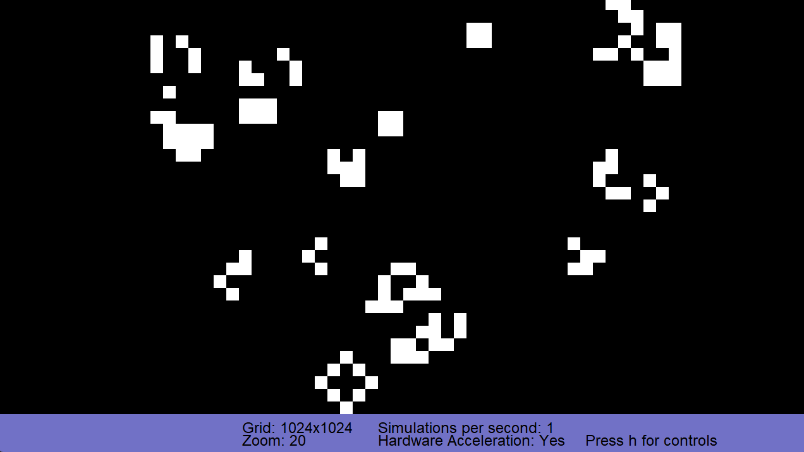

## Game of Life Cuda
### Controls
- +/- $~~~~~~~~~~~~~~~$: Change simulation speed by 1
- +/- + shift $~~~$: Change simulation speed by 10
- +/- + ctrl $~~~~~$: Zoom (hold shift to zoom faster)
- . (dot) $~~~~~~~~~~$: Steps the simulation once
- . + Shift $~~~~~~~$: Steps the simulation 10 times
- . + Ctrl Shift : Steps the simulation 1000 times
- Arrow keys $~~$: Move around the grid (hold shift to move faster)
- Change the cell states by clicking/drawing with the mouse

